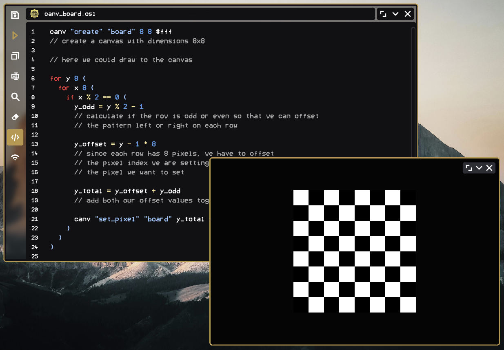

# Canvas

## What is a canvas

An osl canvas is an image held in memory that can be modified quickly and easily by osl.

This is to allow for fast drawing apps and other applications that would not be possible otherwise

## Manage your canvases

```js
canv "create" id width height #colour
// creates a new canvas (used for rendering)
// much faster than the uri commands

canv "remove" id
// deletes the canvas

canv "expand" id width height #colour
// resizes the image with #colour filling in the added parts

canv "stretch" id width height
// stretches the canvas
```

## Get data about canvases

```js
log id.canvWidth()
log id.canvHeight()
// log the width and height of the canvas with this specific id

log id.canvPixels()
// log the number of pixels in the canvas

log id.canvData()
// log the data uri of the canvas
```

## Set and get pixels

```js
canv "set_pixel" id index #colour
// update the canvas pixel at index in "id" to #colour

log id.canvPixel(index)
// log the colour of the pixel at a specific index
```

## Loading a canvas and displaying it in ui

In osl you can load custom images using ids, so here we will simply create a canvas and then get its data uri and then load it as an image. Then we simply render the image on the window

<figure><figcaption></figcaption></figure>

```javascript
canv "create" "board" 8 8 #fff
// create a canvas with dimensions 8x8 and a white background

// here we could draw to the canvas

image "load" "board".canvData() "board"
// load the canvas as an image called "board"

mainloop:

image "board" 300
// render the "board" image with a width of 300

import "win-buttons"
// create the basic window ui
```

## Creating a chess board

Using our previous code, we can simply modify it to set every other pixel in the canvas so that we have a chess board

<figure><figcaption></figcaption></figure>

```javascript
canv "create" "board" 8 8 #fff
// create a canvas with dimensions 8x8

for y 8 (
  // loop through the y axis
  for x 8 (
    // loop through the x axis
    if x % 2 == 0 (
      // only run this if the x axis value is even
    
      y_odd = y % 2 - 1
      // calculate if the row is odd or even so that we can offset
      // the pattern left or right on each row
      
      y_offset = y - 1 * 8
      // since each row has 8 pixels, we have to offset
      // the pixel index we are setting by the number of pixels before
      // the pixel we want to set
      
      y_total = y_offset + y_odd
      // add both our offset values together
      
      canv "set_pixel" "board" y_total + x #000000
    )
  )
)

image "load" "board".canvData() "board"
// load the canvas as an image called "board"

mainloop:

image "board" 300
// render the "board" image with a width of 300

import "win-buttons"
// create the basic window ui
```

